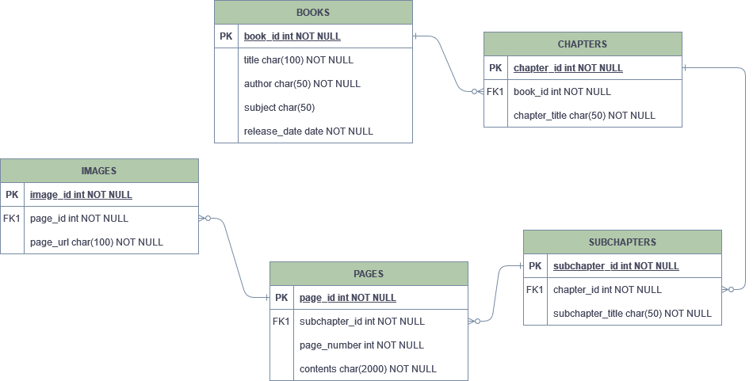

# Testing Strategy & Data Model

## Outline Testing strategy
- Verify the Content screen content
- Verify the Home screen content
- Verify the Library screen content
- Verify the Search screen content
- Verify that the Switch button is working in the Reading screen
- Verify that the OutlinedTextField search is working in the Search screen
- Verify that the toggleReadingMode is working in the Reading app view model
- Navigating to the Library screen by clicking the go to library button from the Home screen
- Navigating to the Contents screen by clicking the Table of Contents button from the Library screen
- Navigating to the Reading screen by clicking on one of the books in the Library screen
- Navigating to the Reading screen by clicking the Read button from the Library screen

## Data Model



In our database, we will have a table to store the general book information such as the title, author, subject, and release date. This information will be displayed in the library screen. When a book is clicked, the app will make a query to the database to find that book’s chapters and subchapters, and it will display them in the table of contents screen. When a subchapter is pressed, the app will make a query to the database to find that subchapter’s pages and contents, and any images contained in that page. Since images can’t be stored in text, we will have a separate table containing all the image URLs in a certain page in order to be able to access them. We chose this data model because it matches the layout of our app, with each table or set of tables being connected to a screen in our app, which will make it simple to implement the database part in our project.

Library screen: Books table  

Table of contents screen: Chapters and Subchapters tables 

Reading screen: Pages and Images tables  


**Examples of queries:**

```sql
SELECT * FROM Books;

SELECT * FROM Chapters WHERE book_id = 1;

SELECT * FROM Pages WHERE subchapter_id = 3;

INSERT INTO Books (title, author, subject, release_date) VALUES ('book1', 'author1', 'science', '24-JAN-25');

INSERT INTO Pages (subchapter_id, page_number, contents) VALUES (2, 3, 'book contents go here');

INSERT INTO Images (page_id, page_url) VALUES (5, 'www.example.com/image');
```